<style>
    .reveal h1, .reveal h2, .reveal h3, .reveal h4, .reveal h5 {
                  text-transform: none;
          }
</style>

# Build <span style='color: red'>AI</span> that matters

Dependable AI systems for real-world impact

<small>

[João Galego](https://jgalego.github.io) $$\left|\text{🧠}\right>$$

Head of AI @ CSW

Invited Professor @ ISEG

</small>

---

# Agenda 📋

--

## Mind the gap

great demos, fragile products

--

## Why AI fails

why models aren't (usually) the problem

--

## Dependable AI

from models to systems

from systems to society {.fragment .fade-in}

--

## AI that (actually) matters

building systems people can trust

--

## Want to dive deeper?

[awesome.critical-ai.dev](https://awesome.critical-ai.dev)


---

# Mind the gap

--

## The AI revolution is <span style='color: red'>accelerating</span>...

--

### [Increased Spending](https://www.idc.com/getdoc.jsp?containerId=prUS49670322)


This year, global spending on AI <br>will reach $300B growing 4.2x faster<br> than average IT spend.

--

### [Widespread Adoption](https://www.gartner.com/document/4839631)


34% of enterprises have deployed <br>AI in production and 22% will <br>deploy in the next 12 months.

--

### [Generative AI Impact](https://www.mckinsey.com/capabilities/mckinsey-digital/our-insights/the-economic-potential-of-generative-ai-the-next-productivity-frontier#introduction)


Generative AI will increase the impact of all AI <br>by 15 to 40% across all industries.

--

## ... but <span style='color: red'>reality</span> tells <br>a different story

--

### [No Roadmap, No Results](https://finance.yahoo.com/news/organizations-accelerating-ai-investments-early-110000212.html)


When it comes to AI adoption,<br> 64% of companies lack a clear roadmap <br>with measurable goals.

--

### [Spending Big, Delivering Small](https://finance.yahoo.com/news/organizations-accelerating-ai-investments-early-110000212.html)


67% of organizations expect <br>to maintain or increase AI spending, <br>yet only 21% report any proven outcomes.

--

### [From Prototype To Nowhere](https://www.infoworld.com/article/2270692/why-ai-investments-fail-to-deliver.html)


86% of all AI projects <span style='color: red'>fail</span> to deliver, <br> while 50% never make it to production.

--

## The AI <span style='color: red'>production gap</span> <br>is real and growing...

--

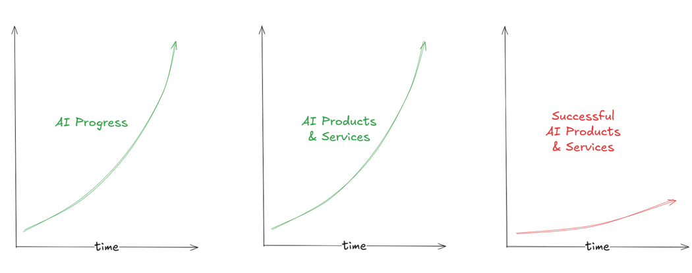

--

## Why is it so <span style='color: red'>hard</span> <br>to *productionize* ML?

--

### The State of Production ML in 2025

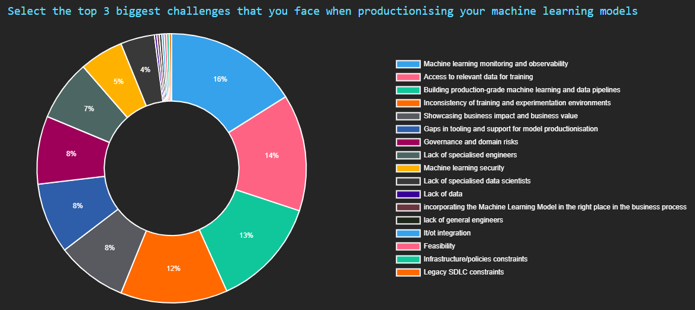<br>

<small>

**Source:** [The Institute for Ethical AI & Machine Learning](https://ethical.institute/state-of-ml-2025)

</small>

--

### <span style='color: red'>Not-So-Hidden</span> technical debt in ML systems

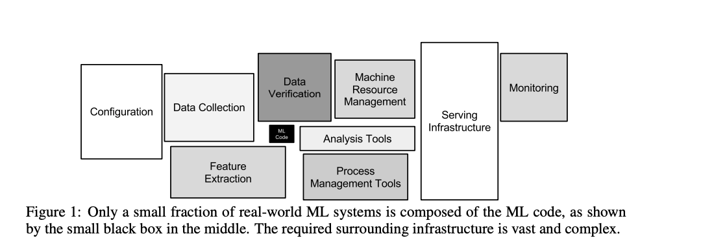<br>

<small>

**Source:** Adapted from Sculley *et al.* (2015)

</small>

--

## In software applications, <br>ML is just <span style='color: red'>one among many</span> <br>components...

--

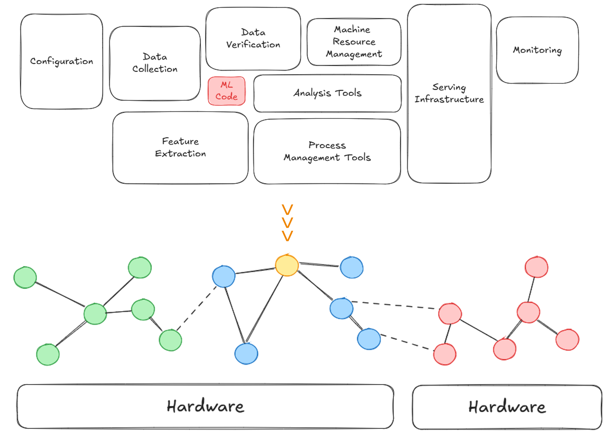<br>

--


---

# Why AI <span style='color: red'>fails</span>

--

### Here's an uncomfortable truth...

Most AI talks tend to focus on: {.fragment .fade-in}

- better models {.fragment .fade-in}
- bigger models {.fragment .fade-in}
- more data {.fragment .fade-in}
- higher scores {.fragment .fade-in}

<!-- TODO: (optional) add images to illustrate each point -->

--

## The Main Problem

Real-world impact isn't about **intelligence**.

It's about <span style='color: red'>**RELIABILITY**</span>. {.fragment .fade-in}

--

## NOT

> Can we build AI?

--

## BUT

> Can we **trust** it when it matters?

--

## Why should we care?

Because AI is already <span style='color: red'>everywhere</span><br> that matters most {.fragment .fade-in}

--

### [AI is saving lives in the ICU...](https://link.springer.com/article/10.1007/s00134-023-07102-y)


--

### [... making life-or-death decisions](https://link.springer.com/article/10.1007/s00134-023-07102-y)


--

### [AI is flying drones...](https://www.flyeye.io/how-ai-is-used-in-drones/)


--

### [... and directing air traffic](https://interactive.aviationtoday.com/avionicsmagazine/november-december-2022/how-ai-makes-air-traffic-management-more-predictable-and-more-efficient/)


<!--img src=https://s3.amazonaws.com/marquee-test-akiaisur2rgicbmpehea/F0wnRGIzRjGQueN4Ovrj_Heathrow0202aa.jpg width=50%/-->

--

### [AI is in space...](https://parolaanalytics.com/parolanews/ai-nasa-autonomous-in-space-assembly-tech/)


--

### [AI is in space...](https://science.nasa.gov/science-research/science-enabling-technology/new-ai-algorithms-streamline-data-processing-for-space-based-instruments/)


--

### [... and inside nuclear reactors](https://www.anl.gov/ntns/article/nuclear-energy-becomes-smarter-and-safer-with-ai)


--

### [... and inside nuclear reactors](https://www.anl.gov/ntns/article/nuclear-energy-becomes-smarter-and-safer-with-ai)


--

### **Sidenote:** [Datacenters in space](https://taranis.ie/datacenters-in-space-are-a-terrible-horrible-no-good-idea/) // Taranis

Why it's a terrible, horrible, no good idea


--

### **Sidenote:** [Vibe nuclear](https://pivot-to-ai.com/2025/11/18/vibe-nuclear-lets-use-ai-shortcuts-on-reactor-safety/) // Pivot-to-AI

What it is & why it's a bad idea


--

## AI is in our <span style='color: red'>critical</span> services

We barely even notice it anymore

**unless something goes wrong** {.fragment .fade-in}

--

## What is a <span style='color: red'>critical</span> system?

--

A system whose failure may cause

- injury or loss of life 😵
- infrastructure damage 💥
- environmental harm 🚱
- mission failure 🚀
- major financial loss 📉

<!--

**Examples:**

Patient monitoring $\rightarrow$ Delayed treatment

Aircraft navigation $\rightarrow$ Accidents

Power grid control $\rightarrow$ Blackouts

Core banking $\rightarrow$ Financial disruption

-->

--

## When these systems <span style='color: red'>fail</span>...

real accidents happen! {.fragment .fade-in}

--

### [Mars Climate Orbiter](https://science.nasa.gov/mission/mars-climate-orbiter/)

Lost a spacecraft because one team <br>used metric and the other used imperial 📏


--

### [Patriot Missile Failure](https://cs.nyu.edu/~exact/resource/mirror/patriot.htm)

Killed 28 soldiers due to a cumulative <br>rounding error in the system’s software 🎯


--

### [Knight Capital Trading Glitch](https://www.cio.com/article/286790/software-testing-lessons-learned-from-knight-capital-fiasco.html)

Lost $440M in 30 minutes <br> after deploying buggy code 💸


--

### [Toyota Unintended Acceleration](https://www.transportation.gov/briefing-room/us-department-transportation-releases-results-nhtsa-nasa-study-unintended-acceleration)

Spaghetti code broke the brakes 🚗


--

### Good enough is <span style='color: red'>not</span> good enough

(not in critical systems)

--

> “Do you code with your <br>loved ones in mind?”

<small>

― Emily Durie-Johnson, [Strategies for Developing Safety-Critical Software in C++](https://www.youtube.com/watch?v=VJ6HrRtrbr8)

</small>

--

## Where does that leave <br>AI in <span style='color: red'>critical</span> systems?

When the stakes are this high...

is it really a good idea? {.fragment .fade-in}

--

### Traditional software

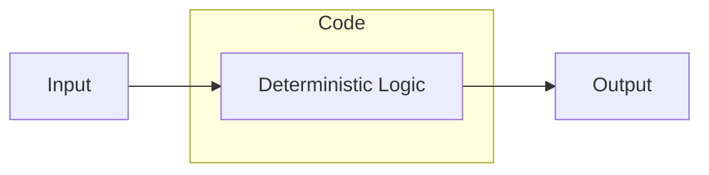

--

**Key properties:**

- deterministic
- explicit rules
- predictable behavior
- easier debugging

--

#### What is <span style='color: red'>determinism</span>?

<br>

<small>

**Source:** [Andersson *et al.* (2024)](https://ieeexplore.ieee.org/document/10748739)

</small>

--

#### [Defeating Nondeterminism in LLM Inference](https://thinkingmachines.ai/blog/defeating-nondeterminism-in-llm-inference/)

<br>

<small>

**Source:** He *et al.* (2025)

</small>

--

## ML Systems

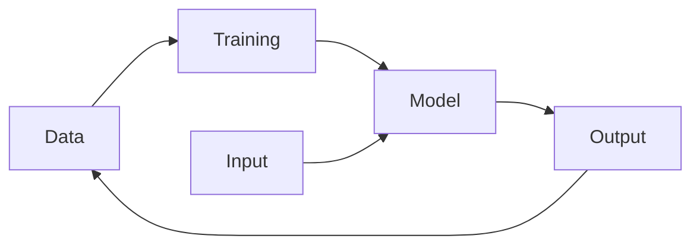

--

**Key properties:**

- probabilistic
- behavior learned from data
- performance depends on data distribution

--

## Key Point

Complex systems fail in ways we can't predict.

AI amplifies complexity - and complexity breaks things. {.fragment .fade-in}

--

## S*** happens!

Models *will* make <span style='color: red'>mistakes</span>

--

### [Just stick something to it...](https://spectrum.ieee.org/slight-street-sign-modifications-can-fool-machine-learning-algorithms)

or when is a stop sign not like a stop sign?


--

### [Nissan's Emergency Braking](https://incidentdatabase.ai/cite/341/)

False positives posed traffic risks to drivers


--

### [Waymo School Bus Problem](https://philkoopman.substack.com/p/the-waymo-school-bus-problem)

Polite software that 'moved out of the way' <br> by illegal passing. 🚌


--

### Even great models *eventually* fail...

often in **strange** and **unpredictable** ways {.fragment .fade-in}

--

## How can we fight this?

Let's turn to the [ECSS ML handbook](https://ecss.nl/home/ecss-e-hb-40-02a-15-november-2024/)... {.fragment .fade-in}

--

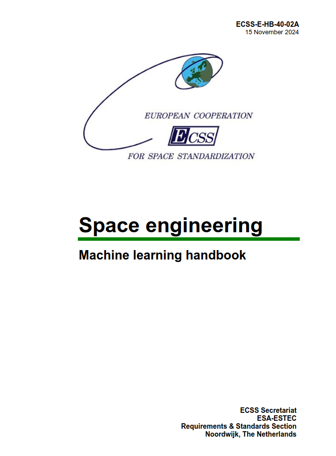

--

**Golden Rule #1**

> Do <span style='color: red'>**NOT**</span> build AI <br>just because you have data.

--

**Golden Rule #2**

> Do <span style='color: red'>**NOT**</span> use AI <br>just because you can.

--

### Safety Cage Architecture

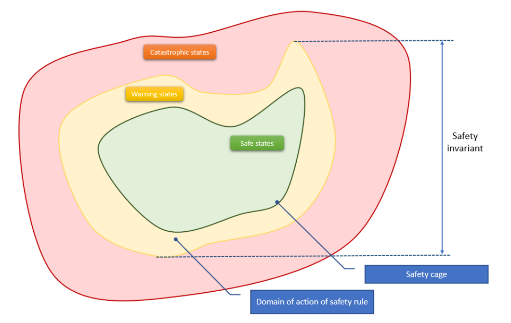

--

#### Key Idea

Don't try to prove that the ML system is safe.

Instead, **constrain** it so it can't be unsafe. {.fragment .fade-in}

--

### Safety Envelope > Doer/Checker

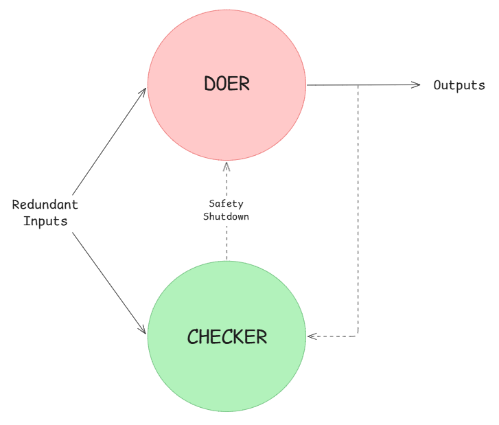<br>

--

### Safety Envelope > Doer/Checker

The doer optimizes for performance.

The checker handles <span style='color: red'>**safety**</span>. {.fragment .fade-in}

--

### Doer/Checker > Automotive

The doer can be low SIL.

The checker <u>*must*</u> be **high** SIL. {.fragment .fade-in}

--

#### Automotive > ISO26262

Safety Integrity Levels (SIL)


--

#### Aerospace > DO-178C

Development Assurance Levels (DAL)


--

##### [Runway Sign Classifier](https://www.mathworks.com/help/deeplearning/ug/verify-an-airborne-deep-learning-system.html)

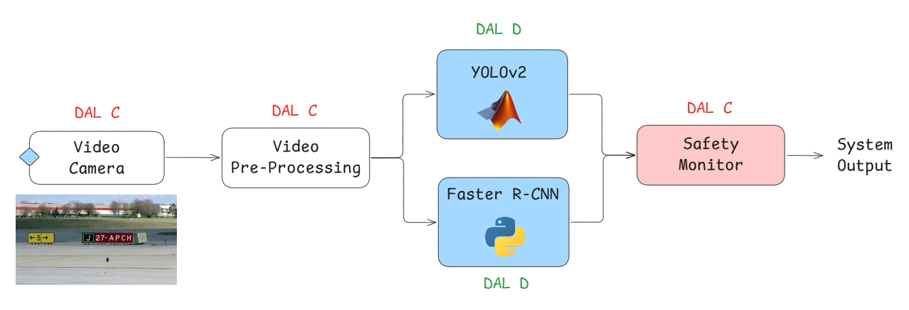<br>

<small>

**Source:** Adapted from [Dimitriev *et al.* (2023)](https://arxiv.org/abs/2310.06506)

</small>

--

##### Sidenote: [NASA on LLMs for Assurance](https://ntrs.nasa.gov/citations/20250001849)

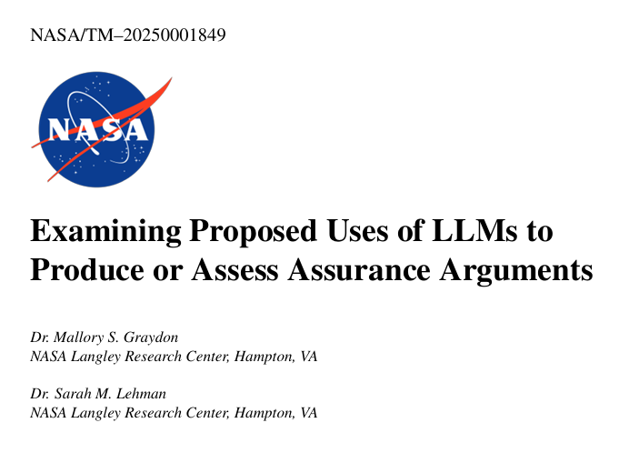

--

### Neural Simplex Architecture

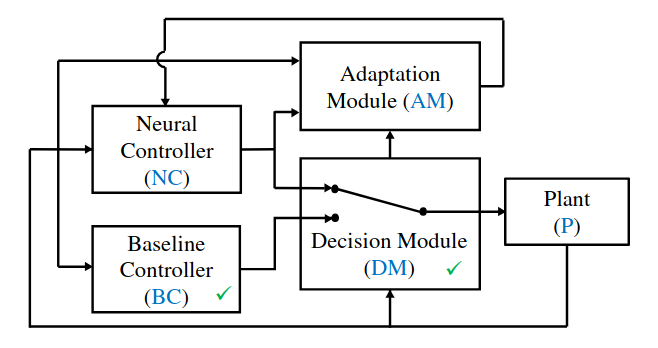<br>

<small>

**Source:** [Phan *et al.* (2019)](https://arxiv.org/abs/1908.00528)

</small>

--

### Simplex Architecture > Automotive

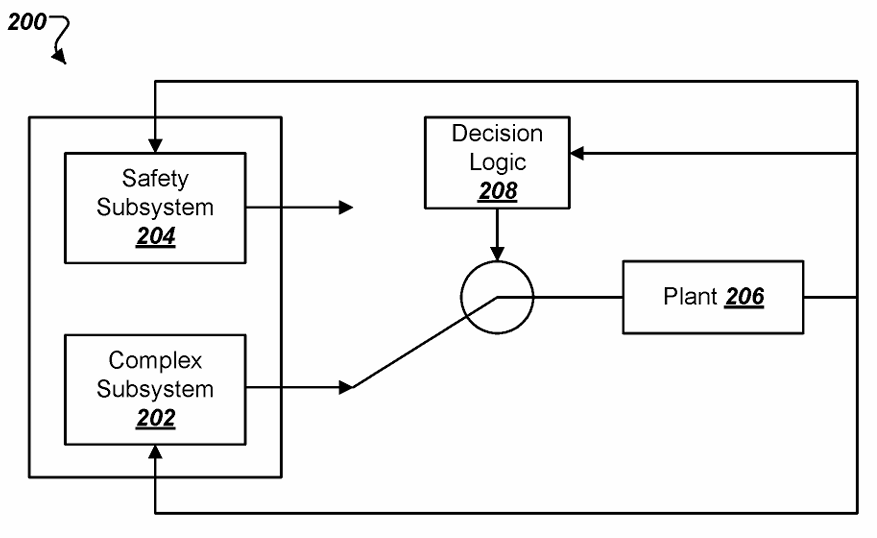<br>

--

### Patent: [US10962972B2](https://patents.google.com/patent/US10962972B2/en)

Safety Architecture for Autonomous Vehicles

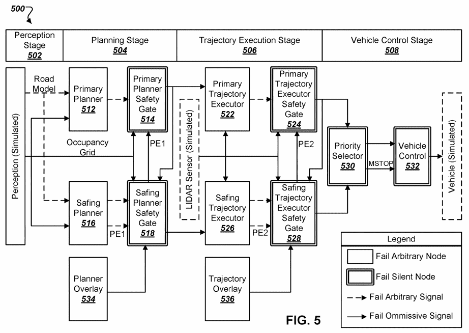<br>

--

#### Saab / Helsing Collaboration


<small>

> "While all of Helsing’s work primarily focused on software model training, integration with Gripen E APIs and testing, Saab actually set the groundwork for operating a software-defined aircraft several years ago with an overhaul to the Gripen’s avionics."

</small>

--

### Saab's [Split Avionics](https://www.mobilityengineeringtech.com/component/content/article/53597-are-military-avionics-systems-ready-for-artificial-intelligence)


--

#### Tactical vs Flight Critical

 

<small>

> "Gripen’s avionics system separates 10% of the aircraft's flight critical management codebase from 90% of its tactical management code, resulting in avionics that are 'hardware agnostic'."

</small>

--

#### [Software-Defined Assurance](https://helsing.ai/newsroom/helsing-white-paper-software-defined-assurance) / Helsing

<small>

> **Many of the well-known approaches used to ensure the reliability of software are difficult or impossible to apply to AI-based software**, where models are created
from data rather than hand-coded by software developers. This creates
friction in the commissioning and development of AI-based software,
because it is unclear what criteria will be used to assure it.
The potential worst case is that assurance of systems involving AI are
subject to a matrix of both poorly-fitting existing requirements and new
but underspecified AI-related requirements.

</small>

--

### Airborne AI/ML Assurance Lifecycle 

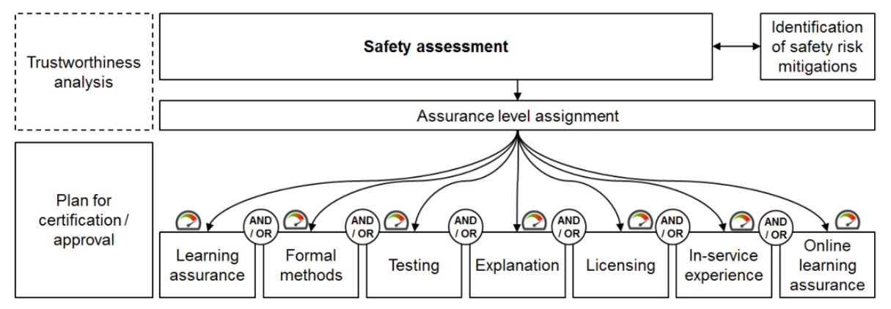

--

### Testing

Test the system like any other critical software.

--


--

The [ECSS ML handbook](https://ecss.nl/home/ecss-e-hb-40-02a-15-november-2024/) suggests checking:

- specific examples

- neural network coverage

- out of distribution examples

- adversarial examples

--

### V-Cycle $\rightarrow$ W-Cycle

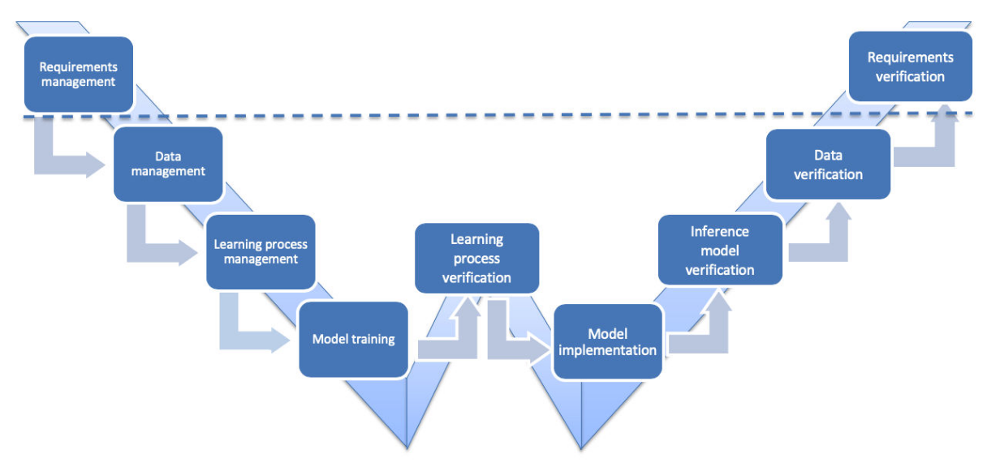<br>

<small>

**Source:** [EASA / Daedalean (2024)](https://www.easa.europa.eu/en/document-library/general-publications/concepts-design-assurance-neural-networks-codann)

</small>

--

### Formal Verification

*Mathematically* prove certain behaviors <br>cannot happen.

--

[Natural Language $\rightarrow$ Temporal Logic Formulas](https://conformalnl2ltl.github.io/)

<video controls width=50%>
    <source src="https://conformalnl2ltl.github.io/video/robot_dog_1.mp4">
</video>

--

[Minimize Hallucinations with Automated Reasoning](https://aws.amazon.com/blogs/aws/minimize-ai-hallucinations-and-deliver-up-to-99-verification-accuracy-with-automated-reasoning-checks-now-available/)


--

#### <span style='color: red'>Safety property</span>

> "bad thing never happens"

$$\square ~\neg \texttt{bad}$$

--

#### <span style='color: green'>Liveness property</span>

> "good thing eventually happens"

$$\diamond ~\texttt{good}$$

--

#### Reactive System

Systems that maintain an ongoing interaction <br>with the environment, as opposed to computing <br>some final value on termination.

--

##### Concurrent programs


--

##### Embedded and process control programs


--

##### Perpetually ongoing processes


--

##### Operating systems


--

### These systems are not defined <br>by **what** they do

but <span style='color: red'>**when**</span> they do it. {.fragment .fade-in}

--

### Intelligent or not...

Building reactive systems is hard!

--

There's a saying at Google...

> "Software engineering is programming integrated over **time**." {.fragment .fade-in}

<small>

Winters, Manshreck & Wright (2020)

</small>

--

$$\texttt{SWE} = \int \texttt{Programming} ~dt$$

--

$$f \mapsto \texttt{E}[f] = \int^{\min\[\text{EOL}, +\infty\]}_{\max\[-\infty, \text{idea}\]} f ~dt$$

In postfix notation: $f\texttt{E}$

i.e. $\texttt{SWE} = \texttt{E}[\texttt{SW}]$

<!-- TODO: develop calculus argument -->

---

# <span style='color: red'>Dependable</span> AI

--

## The <span style='color: red'>Real</span> Problem

The challenge isn't model accuracy.

It's system reliability under **uncertainty**.

--

## From Models to Systems

Typical ML focuses on

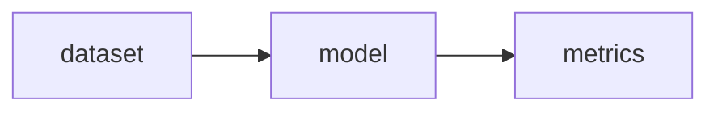

--

Real systems require

- data pipelines
- feature pipelines
- monitoring
- evaluation
- human fallback
- governance

--

## Dependable AI Stack

Data Quality

Model Robustness

System Design

Monitoring & Feedback

Governance

--

## Dependable AI Mindset

1. Expect failure

2. Design for recovery

3. Monitor everything

4. Keep humans around

--

## Engineering Best Practices

What to do, how to do it and why

--

### Data

> Garbage in, garbage out

--

**AI systems learn from data.**

If the data is wrong, incomplete, or drifting, {.fragment .fade-in}

the system will fail. {.fragment .fade-in}

--

Focus on:
- data validation
- dataset versioning
- distribution monitoring
- label quality checks

--

You don’t control your model,

**your data does**

--

## Model

> Accuracy isn't reliability

--

A high benchmark score does not guarantee <br> **safe real-world behavior**

--

Evaluate for:
- robustness
- edge cases
- distribution shift
- calibration

--

Test the failure modes,

**not** just the average case.

--

## Observability

> If you can’t see it, you can’t trust it.

--

Track:
- data drift
- prediction drift
- system health
- anomaly signals

--

Silent failures are the most dangerous failures.

--

## Guardrails

> Expect failure. Design for safety.

--

Models will eventually fail.

Systems must handle that *safely*.

--

Common patterns:

- confidence thresholds
- fallback logic
- human escalation
- policy checks

--

Reliable systems fail *gracefully*.

--

## Humans

> AI works best when we are around

--

Humans provide:

- context
- judgment
- accountability

--

Design systems that allow:

- review
- intervention
- override

--

```python
# Predict: AI takes a shot...
result, confidence = model.predict(input_data)

# Check: Too unsure? Don't guess!
if confidence < threshold:
    result = route_to_fallback() or route_to_human()

# Log: Always leave a trail
log_decision(input_data, result)
```

--

### Human <span style='color: red'>in</span> the loop

AI acts only when a <br>human approves each decision.

--

### Human <span style='color: red'>on</span> the loop

AI acts autonomously, but humans <br>monitor and can intervene.

--

### Human <span style='color: red'>over</span> the loop

AI operates independently, while humans <br>set goals and review outcomes.

--

Humans are not the weakness.

**We are part of the safety system.**

--

Dependability is <span style='color: red'>not</span> a feature.

**It's engineering discipline.** {.fragment .fade-in}

---

# AI that (actually) matters

--

## AI <span style='color: red'>where</span> it matters most

--

High-stakes domains:

- healthcare
- aviation
- energy
- finance
- defence

--

**NOT**

Build smarter AI

**BUT** {.fragment .fade-in}

Build trustworthy systems {.fragment .fade-in}

that safely amplify our capabilities. {.fragment .fade-in}

--

## We need to <span style='color: red'>pivot</span>

--

model accuracy $\rightarrow$ system reliability

benchmarks $\rightarrow$ real-world impact {.fragment .fade-in}

research $\rightarrow$ engineering {.fragment .fade-in}

--

Real engineering does stop at *it works*.

It begins at <span style='color: red'><u>**it lasts**</u></span></u>. {.fragment .fade-in}

--

## Build AI that <span style='color: green'>matters</span>

AI first, human always!