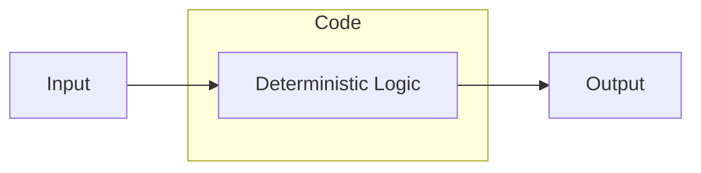
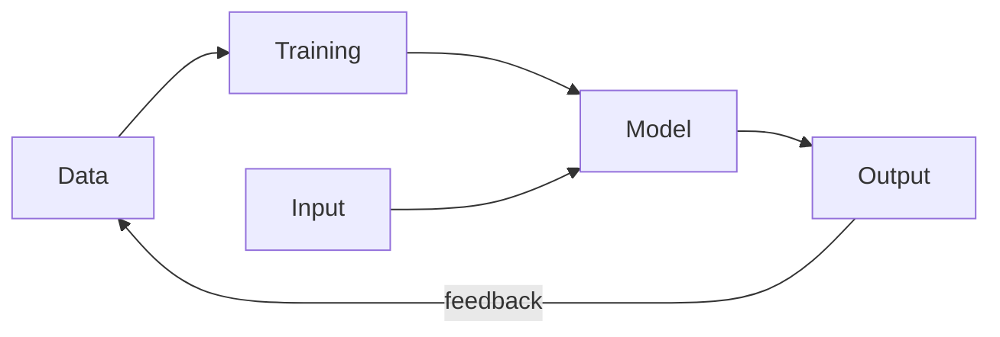
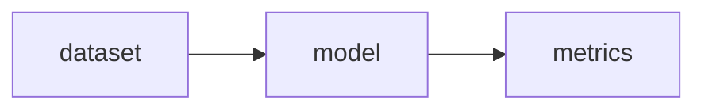

<style>
    .reveal h1, .reveal h2, .reveal h3, .reveal h4, .reveal h5 {
                  text-transform: none;
          }
</style>

# Build <span style='color: red'>AI</span> that matters

Dependable AI systems for real-world impact

<small>

[João Galego](https://jgalego.github.io) $$\left|\text{🧠}\right>$$

Head of AI @ CSW

Invited Professor @ ISEG

</small>

---

# Agenda 📋

--

## The Production Gap

great demos, fragile systems

--

## Why AI Fails

why the model (usually) isn’t the problem

--

## Dependable AI

from models to systems

--

## AI that (actually) matters

building systems people can trust

--

## Want to dive deeper?

[awesome.critical-ai.dev](https://awesome.critical-ai.dev)


---

# Why AI <span style='color: red'>fails</span>

--

**Here's an uncomfortable truth...**

Most AI talks focus on {.fragment .fade-in}

- better models {.fragment .fade-in}
- bigger models {.fragment .fade-in}
- more benchmarks {.fragment .fade-in}

--

**BUT**

Real-world impact relies on something else...

<span style='color: red'>**RELIABILITY**</span> {.fragment .fade-in}

--

**NOT**

> Can we build AI?

--

**BUT**

> Can we **trust** it when it matters?

--

## Why is this important?

Because AI is already in <span style='color: red'>**critical**</span> systems... {.fragment .fade-in}

--

### [AI is helping in the ICU](https://link.springer.com/article/10.1007/s00134-023-07102-y)


--

### [AI is navigating drones](https://www.flyeye.io/how-ai-is-used-in-drones/)


--

### [AI is managing air traffic](https://interactive.aviationtoday.com/avionicsmagazine/november-december-2022/how-ai-makes-air-traffic-management-more-predictable-and-more-efficient/)


--

### [AI is in space...](https://science.nasa.gov/science-research/science-enabling-technology/new-ai-algorithms-streamline-data-processing-for-space-based-instruments/)


--

### [... and inside nuclear reactors](https://www.anl.gov/ntns/article/nuclear-energy-becomes-smarter-and-safer-with-ai)


--

### **Sidenote:** [Datacenters in space](https://taranis.ie/datacenters-in-space-are-a-terrible-horrible-no-good-idea/) // Taranis

Why it's a terrible, horrible, no good idea


--

### **Sidenote:** [Vibe nuclear](https://pivot-to-ai.com/2025/11/18/vibe-nuclear-lets-use-ai-shortcuts-on-reactor-safety/) // Pivot-to-AI

What it is & why it's a bad idea


--

## What is a <span style='color: red'>critical</span> system?

--

A system whose failure may cause

- injury or loss of life 😵
- infrastructure damage 💥
- environmental harm 🚱
- mission failure 🚀
- major financial loss 📉

<!--

**Examples:**

Patient monitoring $\rightarrow$ Delayed treatment

Aircraft navigation $\rightarrow$ Accidents

Power grid control $\rightarrow$ Blackouts

Core banking $\rightarrow$ Financial disruption

-->

--

## When these systems <span style='color: red'>fail</span>...

real accidents happen! {.fragment .fade-in}

--

### [Mars Climate Orbiter](https://science.nasa.gov/mission/mars-climate-orbiter/)

Lost a spacecraft because one team used metric <br>and the other used imperial 🚀📏


--

### [Patriot Missile Failure](https://cs.nyu.edu/~exact/resource/mirror/patriot.htm)

Missed a missile due to a rounding error 🎯


--

### [Knight Capital Trading Glitch](https://www.cio.com/article/286790/software-testing-lessons-learned-from-knight-capital-fiasco.html)

Lost $440M in 30 minutes <br> after deploying buggy code 💸


--

### [Toyota Unintended Acceleration](https://www.transportation.gov/briefing-room/us-department-transportation-releases-results-nhtsa-nasa-study-unintended-acceleration)

Spaghetti code broke the brakes 🚗


--

## Why AI systems are <span style='color: red'>hard</span>

Complex systems fail in surprising ways.

--

### Traditional software



--

**Key properties:**

- deterministic
- explicit rules
- predictable behavior
- easier debugging

--

## ML Systems



--

**Key properties:**

- probabilistic
- behavior learned from data
- performance depends on data distribution

--

This leads to more uncertainty and <br>hidden failure modes

--

## S*** happens!

Models *will* make <span style='color: red'>mistakes</span>

--

### [Just stick something to it...](https://spectrum.ieee.org/slight-street-sign-modifications-can-fool-machine-learning-algorithms)

or when is a stop sign not like a stop sign?


--

### [Nissan's Emergency Braking](https://incidentdatabase.ai/cite/341/)

False positives posed traffic risks to drivers


--

### [Waymo School Bus Problem](https://philkoopman.substack.com/p/the-waymo-school-bus-problem)

Polite software that 'moved out of the way' <br> by illegal passing. 🚌


--

### Even great models *eventually* fail...

often in **strange** and **unpredictable** ways {.fragment .fade-in}

--

## How can we fight this?

--

### Sofware Testing

Test the system like any other critical software.

--

The [ECSS ML handbook](https://ecss.nl/home/ecss-e-hb-40-02a-15-november-2024/) suggests:

- specific examples testing

- neural network coverage testing

- out of distribution testing

- adversarial testing

- statistical testing

--

**Golden Rule #1**

> Don't build AI <br>just because you have data.

--

**Golden Rule #2**

> Don't use AI just because you can.

--

### Formal Verification

*Mathematically* prove certain behaviors <br>cannot happen.

--

[Natural Language $\rightarrow$ Temporal Logic Formulas](https://conformalnl2ltl.github.io/)

<video controls width=50%>
    <source src="https://conformalnl2ltl.github.io/video/robot_dog_1.mp4">
</video>

--

[Minimize Hallucinations with Automated Reasoning](https://aws.amazon.com/blogs/aws/minimize-ai-hallucinations-and-deliver-up-to-99-verification-accuracy-with-automated-reasoning-checks-now-available/)


--

def. **Safety property**

> "bad thing never happens"

$$\square ~\neg \texttt{bad}$$

--

def. **Liveness property**

> "good thing eventually happens"

$$\diamond ~\texttt{good}$$

--

def. **Reactive System**

A system that maintains an ongoing interaction <br>with its environment, as opposed to computing <br>some final value on termination.

--

Concurrent programs


--

Embedded and process control programs


--

Perpetually ongoing processes


--

Operating systems


--

### These systems are not defined by **what** they do

but <span style='color: red'>**when**</span> they do it. {.fragment .fade-in}

--

### Intelligent or not...

Building reactive systems is hard!

--

There's a saying at Google...

> "Software engineering is programming integrated over **time**." {.fragment .fade-in}

<small>

Winters, Manshreck & Wright (2020)

</small>

--

$$\texttt{SWE} = \int \texttt{Programming} ~dt$$

--

$$f \mapsto \texttt{E}[f] = \int^{\min\[\text{EOL}, +\infty\]}_{\max\[-\infty, \text{idea}\]} f ~dt$$

In postfix notation: $f\texttt{E}$

i.e. $\texttt{SWE} = \texttt{E}[\texttt{SW}]$

<!-- TODO: develop calculus argument -->

---

# <span style='color: red'>Dependable</span> AI

--

## The <span style='color: red'>Real</span> Problem

The challenge isn't model accuracy.

It's system reliability under **uncertainty**.

--

## From Models to Systems

Typical ML focuses on



--

Real systems require

- data pipelines
- feature pipelines
- monitoring
- evaluation
- human fallback
- governance

--

## Dependable AI Stack

Data Quality

Model Robustness

System Design

Monitoring & Feedback

Governance

--

## Dependable AI Mindset

1. Expect failure

2. Design for recovery

3. Monitor everything

4. Keep humans around

--

## Engineering Best Practices

What to do, how to do it and why

--

### Data

> Garbage in, garbage out

--

**AI systems learn from data.**

If the data is wrong, incomplete, or drifting, {.fragment .fade-in}

the system will fail. {.fragment .fade-in}

--

Focus on:
- data validation
- dataset versioning
- distribution monitoring
- label quality checks

--

You don’t control your model,

**your data does**

--

## Model

> Accuracy isn't reliability

--

A high benchmark score does not guarantee <br> **safe real-world behavior**

--

Evaluate for:
- robustness
- edge cases
- distribution shift
- calibration

--

Test the failure modes,

**not** just the average case.

--

## Observability

> If you can’t see it, you can’t trust it.

--

Track:
- data drift
- prediction drift
- system health
- anomaly signals

--

Silent failures are the most dangerous failures.

--

## Guardrails

> Expect failure. Design for safety.

--

Models will eventually fail.

Systems must handle that *safely*.

--

Common patterns:

- confidence thresholds
- fallback logic
- human escalation
- policy checks

--

Reliable systems fail *gracefully*.

--

## Humans

> AI works best when we are around

--

Humans provide:

- context
- judgment
- accountability

--

Design systems that allow:

- review
- intervention
- override

--

```python
# Predict: AI takes a shot...
result, confidence = model.predict(input_data)

# Check: Too unsure? Don't guess!
if confidence < threshold:
    result = route_to_fallback() or route_to_human()

# Log: Always leave a trail
log_decision(input_data, result)
```

--

Human **in** the loop

Human **on** the loop {.fragment .fade-in}

Human **over** the loop {.fragment .fade-in}

--

Humans are not the weakness.

**We are part of the safety system.**

--

Dependability is <span style='color: red'>not</span> a feature.

**It's engineering discipline.** {.fragment .fade-in}

---

# AI that (actually) matters

--

## AI <span style='color: red'>where</span> it matters most

--

High-stakes domains:

- healthcare
- aviation
- energy
- finance
- defence

--

**NOT**

Build smarter AI

**BUT** {.fragment .fade-in}

Build trustworthy systems {.fragment .fade-in}

that safely amplify our capabilities. {.fragment .fade-in}

--

# We need to <span style='color: red'>pivot</span>

--

model accuracy $\rightarrow$ system reliability

benchmarks $\rightarrow$ real-world impact {.fragment .fade-in}

research $\rightarrow$ engineering {.fragment .fade-in}

--

# Build AI that <span style='color: green'>matters</span>

AI first, human always!