<style>
    .reveal h1, .reveal h2, .reveal h3, .reveal h4, .reveal h5 {
                  text-transform: none;
          }
</style>

# Build <span style='color: red'>AI</span> that matters

Dependable AI systems for real-world impact

<small>

[João Galego](https://jgalego.github.io) $$\left|\text{🧠}\right>$$

Head of AI @ CSW

Invited Professor @ ISEG

</small>

---

# `$ whoami`

--

## Academic Background

MSc Physics <br>
<br>PgDip Forensics<span style='color: blue'>*</span> <br>
<br>PhD Cognitive Science / ABD<span style='color: red'>**</span><br>   

<small>

<span style='color: blue'>* **Not-so-fun fact:** I once performed an autopsy</span>

<span style='color: red'>** Dropped out to live life and have fun doing it</span>

</small>

--

## Professional Experience

Lead ML Engineer


Solutions Architect


Head of AI


--


--

## TL;DR

Break things at scale

Build things faster

Make brains<span style='color: red'>*</span> go brrr

<small>

<span style='color: red'>* **all** brain types welcome!</span>

</small>

---

# Agenda 📋

--

## Mind the <span style='color: red'>gap</span>

great demos, fragile products

--

## Why AI <span style='color: red'>fails</span>

and why models aren't the problem

--

## <span style='color: red'>Dependable</span> AI

models $\rightarrow$ systems $\rightarrow$ society

--

## AI that (actually) <span style='color: green'>matters</span>

building systems people can trust

--

## PR<span style='color: red'>FAQ</span>

what you might be wondering,<br> but were afraid to ask

--

## This talk was inspired by...

[Machine Learning that matters](https://arxiv.org/abs/1206.4656) by Kiri Wagstaff

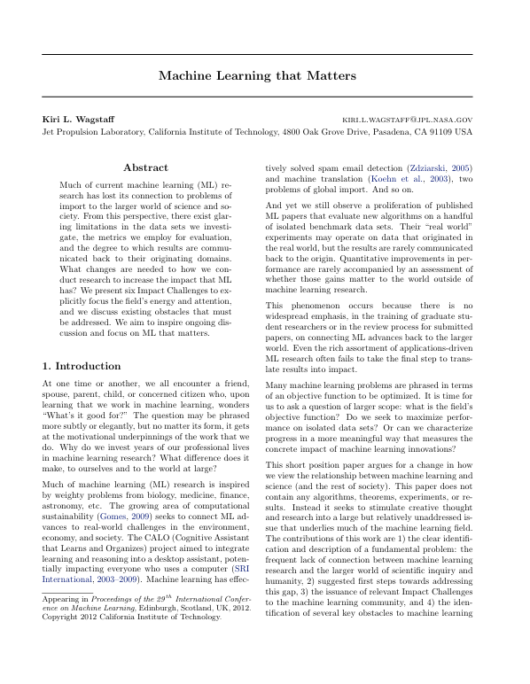 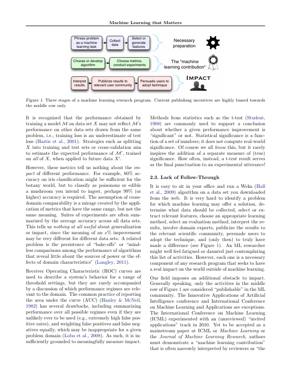

--

### In my first month at Critical...

a colleague pulled me aside and said

> "what you do is <span style='color: red'>not</span> engineering" {.fragment .fade-in}

--

### My first reaction?

Offense {.fragment .fade-in}

### My second? {.fragment .fade-in}

Denial {.fragment .fade-in}

> *"There's more to ML <br>than meets the eye..."* {.fragment .fade-in}

--

### One year later...

I owe them an apology

<span style='color: red'>They were right</span> {.fragment .fade-in}

--

### This talk is my attempt

to set the record straight

--

## Want to dive deeper?

[awesome.critical-ai.dev](https://awesome.critical-ai.dev)


---

# Mind the <span style='color: red'>gap</span>

--

## The AI revolution is <span style='color: red'>accelerating</span>...

--

### [Increased Spending](https://www.idc.com/getdoc.jsp?containerId=prUS49670322)


This year, global spending on AI <br>will reach $300B growing 4.2x faster<br> than average IT spend.

--

### [Widespread Adoption](https://www.gartner.com/document/4839631)


34% of enterprises have deployed <br>AI in production and 22% will <br>deploy in the next 12 months.

--

### [Generative AI Impact](https://www.mckinsey.com/capabilities/mckinsey-digital/our-insights/the-economic-potential-of-generative-ai-the-next-productivity-frontier#introduction)


Generative AI will increase <br>the impact of all AI by 15 to 40% <br>across all industries.

--

## ... but <span style='color: red'>reality</span> tells <br>a different story

--

### [No Roadmap, No Results](https://finance.yahoo.com/news/organizations-accelerating-ai-investments-early-110000212.html)


When it comes to AI adoption,<br> 64% of companies lack a clear roadmap <br>with measurable goals.

--

### [Spending Big, Delivering Small](https://finance.yahoo.com/news/organizations-accelerating-ai-investments-early-110000212.html)


67% of organizations expect <br>to maintain or increase AI spending, yet <br>only 21% report any proven outcomes.

--

### [From Prototype To Nowhere](https://www.infoworld.com/article/2270692/why-ai-investments-fail-to-deliver.html)


86% of all AI projects <span style='color: red'>fail</span> to deliver, <br> while 50% **never** make it to production.

--

## The AI <span style='color: red'>production gap</span> <br>is real and growing...

--


--


 {.fragment .fade-in}

--

## Why is it so <span style='color: red'>hard</span> <br>to *productionize* ML?

--

### The State of <span style='color: red'>Production</span> ML in 2025

<br>

<small>

**Source:** [The Institute for Ethical AI & Machine Learning](https://ethical.institute/state-of-ml-2025)

</small>

--

### <span style='color: red'>Not-So-Hidden</span> technical debt in ML systems

<br>

<small>

**Source:** Adapted from Sculley *et al.* (2015)

</small>

--

## ML is just <span style='color: red'>one among many</span> <br>components...

--

<br>

---

# Why AI <span style='color: red'>fails</span>

--

### Here's an uncomfortable truth...

At any AI conference, you'll hear about: {.fragment .fade-in}

- better models {.fragment .fade-in}
- bigger models {.fragment .fade-in}
- more data {.fragment .fade-in}
- higher scores {.fragment .fade-in}

--

## The Main Problem

Real-world impact isn't about **intelligence**.

It's about <span style='color: red'>**RELIABILITY**</span>. {.fragment .fade-in}

--

## NOT

> Can we build AI?

--

## BUT

> Can we **trust** it when it matters?

--

### Meet [US6883201B2](https://patents.google.com/patent/US6883201B2/en) AKA Roomba

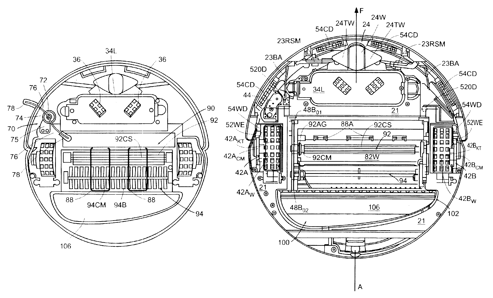

--

### Vacuum cleaning is *simple*... right?

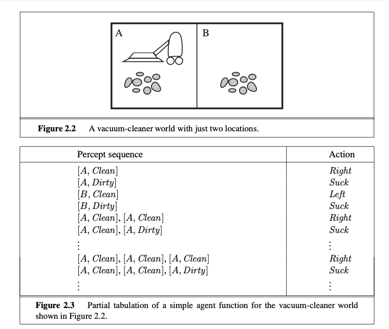

--

### Vacuum cleaning is *simple*... right?

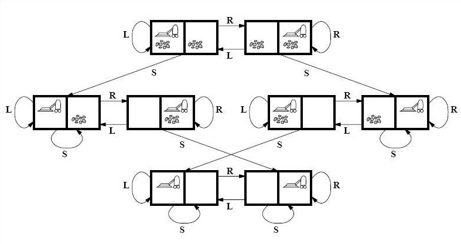

--

<iframe width="560" height="315" src="https://www.youtube.com/embed/fjRWHmvYTbM" title="YouTube video player" frameborder="0" allow="accelerometer; autoplay; clipboard-write; encrypted-media; gyroscope; picture-in-picture; web-share" allowfullscreen></iframe>

--

### Let's play a game...


--

### There are 3 main reasons <br> why ML systems are removed <br>from <span style='color: red'>`prod`</span>...

Who wants to take a guess?

--

### 🥉 Cost {.fragment .fade-in}

### 🥈 Security {.fragment .fade-in}

### 🥇 <span style='color: red'>**RELIABILITY**</span> {.fragment .fade-in}

--

### Measuring Agents in <span style='color: red'>Production</span>

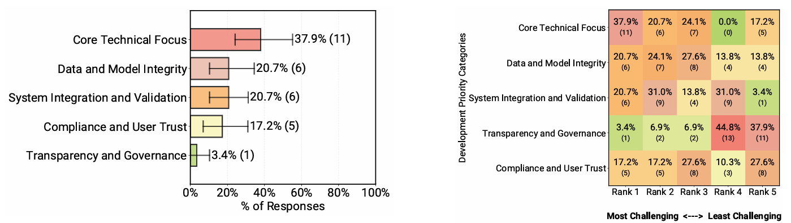<br>

<small>

**Source:** [Pan *et al.* (2025)](https://arxiv.org/abs/2512.04123)

</small>

--

<iframe width="560" height="315" src="https://www.youtube.com/embed/rwabBOXeu2E" title="YouTube video player" frameborder="0" allow="accelerometer; autoplay; clipboard-write; encrypted-media; gyroscope; picture-in-picture; web-share" allowfullscreen></iframe>

--

## Why does this matter?

Because AI is already <span style='color: red'>everywhere</span><br> that matters most {.fragment .fade-in}

--

### [AI is saving lives in the ICU...](https://link.springer.com/article/10.1007/s00134-023-07102-y)


--

### [... making life-or-death decisions](https://link.springer.com/article/10.1007/s00134-023-07102-y)


--

### [AI is flying drones...](https://news.mit.edu/2025/ai-enabled-control-system-helps-autonomous-drones-uncertain-environments-0609)


--

### [... and directing air traffic](https://interactive.aviationtoday.com/avionicsmagazine/november-december-2022/how-ai-makes-air-traffic-management-more-predictable-and-more-efficient/)


<!--img src=https://s3.amazonaws.com/marquee-test-akiaisur2rgicbmpehea/F0wnRGIzRjGQueN4Ovrj_Heathrow0202aa.jpg width=50%/-->

--

### [AI is in space...](https://www.esa.int/Applications/Observing_the_Earth/Phsat-2/New_satellite_demonstrates_the_power_of_AI_for_Earth_observation)


--

#### [ESA's Φsat-2](https://www.esa.int/Applications/Observing_the_Earth/Phsat-2/New_satellite_to_show_how_AI_advances_Earth_observation)


--

##### Maritime Vessel Detection


--

##### Wildfire Detection


--

#### [Autonomous in-space assembly](https://parolaanalytics.com/parolanews/ai-nasa-autonomous-in-space-assembly-tech/)


--

##### "(...) a convergence of modern control theory, <br>and machine learning" (Patent: [US11989009B2](https://patents.google.com/patent/US11989009B2/en))

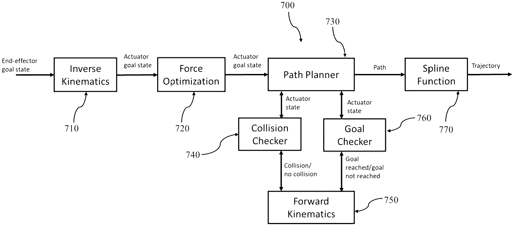

<!--

### [AI is in space...](https://science.nasa.gov/science-research/science-enabling-technology/new-ai-algorithms-streamline-data-processing-for-space-based-instruments/)


-->

--

### [Datacenters in space](https://taranis.ie/datacenters-in-space-are-a-terrible-horrible-no-good-idea/) // Taranis

Why it's a terrible, horrible, no good idea


--

### [AI is inside nuclear reactors](https://www.anl.gov/ntns/article/nuclear-energy-becomes-smarter-and-safer-with-ai)


--

#### [The Atom and the Algorithm](https://www.iaea.org/newscenter/statements/the-atom-and-the-algorithm-nuclear-energy-and-ai-are-converging-to-shape-the-future)

Nuclear energy and AI are converging <br>to shape the future


--

#### AI is already improving <span style='color: red'>nuclear</span> <br> in many ways...

- Operations / predictive maintenance

- Design / reactor modelling

- Safety / accident simulation

- Safeguards / surveillance footage analysis

--

> "Reassuringly, despite its brilliance, **AI still needs a human** to make sure it is right and impartial, and to understand the politics behind a safeguards footnote"

<small>

**Source:** [IAEA Director General Rafael Mariano Grossi](https://www.iaea.org/newscenter/statements/the-atom-and-the-algorithm-nuclear-energy-and-ai-are-converging-to-shape-the-future)

</small>

--

#### Nuclear at Argonne / PRO-AID

<iframe width="560" height="315" src="https://www.youtube.com/embed/a3Qo7jfX2Rk" title="YouTube video player" frameborder="0" allow="accelerometer; autoplay; clipboard-write; encrypted-media; gyroscope; picture-in-picture; web-share" allowfullscreen></iframe>

--

### [Vibe nuclear](https://pivot-to-ai.com/2025/11/18/vibe-nuclear-lets-use-ai-shortcuts-on-reactor-safety/) // Pivot-to-AI

What it is & why it's a bad idea


--

## AI is in our <span style='color: red'>critical</span> services...

quietly running in the background

until something goes ʷrₒnᵍ {.fragment .fade-in}

--

## What is a <span style='color: red'>critical</span> system?

--

A system whose failure may cause

- injury or loss of life 😵
- infrastructure damage 💥
- environmental harm 🚱
- mission failure 🚀
- major financial loss 📉

<!--

**Examples:**

Patient monitoring $\rightarrow$ Delayed treatment

Aircraft navigation $\rightarrow$ Accidents

Power grid control $\rightarrow$ Blackouts

Core banking $\rightarrow$ Financial disruption

-->

--

## When these systems <span style='color: red'>fail</span>...

real accidents happen! {.fragment .fade-in}

--

### [Mars Climate Orbiter](https://science.nasa.gov/mission/mars-climate-orbiter/)

Lost a spacecraft because one team <br>used metric and the other used imperial 📏


--

### [Patriot Missile Failure](https://cs.nyu.edu/~exact/resource/mirror/patriot.htm)

Killed 28 soldiers due to a cumulative <br>rounding error in the system’s software 🎯


--

### [Knight Capital Trading Glitch](https://www.cio.com/article/286790/software-testing-lessons-learned-from-knight-capital-fiasco.html)

Lost $440M in 30 minutes <br> after deploying buggy code 💸


--

### [Toyota Unintended Acceleration](https://www.transportation.gov/briefing-room/us-department-transportation-releases-results-nhtsa-nasa-study-unintended-acceleration)

Spaghetti code broke the brakes 🚗


--

### Key Point

Complex systems fail in ways we can't predict.

--

### Good enough is <span style='color: red'>not</span> good enough

At least, not in critical systems

--

> “Do you code with your <br>loved ones in mind?”

<small>

― Emily Durie-Johnson, [Strategies for Developing Safety-Critical Software in C++](https://www.youtube.com/watch?v=VJ6HrRtrbr8)

</small>

--

## When the stakes are this high...

Where does that leave AI in <span style='color: red'>critical</span> systems?

Is it really a good idea? {.fragment .fade-in}

--

### Traditional software


--

#### It does exactly what you tell it to do...

- Same input, same ouput... always

- Rules are explicit and readable

- Bugs have clear causes and fixes

--

You write the rules

You know what it will do {.fragment .fade-in}

You know why it broke {.fragment .fade-in}

--

#### What is <span style='color: red'>determinism</span>?

<br>

<small>

**Source:** [Andersson *et al.* (2024)](https://ieeexplore.ieee.org/document/10748739)

</small>

--

#### [Defeating Nondeterminism in LLM Inference](https://thinkingmachines.ai/blog/defeating-nondeterminism-in-llm-inference/)

<br>

<small>

**Source:** He *et al.* (2025)

</small>

--

## ML Systems

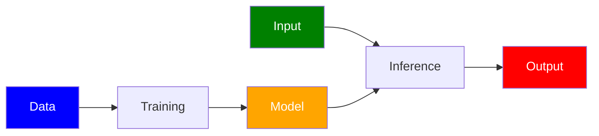

--

You shift the agency to **data**:

- The data wrote the rules

- Change the data, change the behavior

- Garbage in, garbage out

--

You <u>didn't</u> write the rules

You <u>don't</u> always know what it will do

You <u>don't</u> always know why it broke

--

## AI amplifies complexity...

and complexity <span style='color: red'>breaks</span> things. {.fragment .fade-in}

--

## S*** happens!

Models *will* make <span style='color: red'>mistakes</span>

--

### [Just stick something to it...](https://spectrum.ieee.org/slight-street-sign-modifications-can-fool-machine-learning-algorithms)

or when is a stop sign not like a stop sign?


--

### [Nissan's Emergency Braking](https://incidentdatabase.ai/cite/341/)

False positives posed traffic risks to drivers


--

### [Waymo School Bus Problem](https://philkoopman.substack.com/p/the-waymo-school-bus-problem)

Polite software that 'moved out of the way' <br> by illegal passing. 🚌


--

### Even great models *eventually* fail...

often in **strange** and **unpredictable** ways {.fragment .fade-in}

--

## How can we fight this?

Let's turn to the [ECSS ML handbook](https://ecss.nl/home/ecss-e-hb-40-02a-15-november-2024/)... {.fragment .fade-in}

--


--

**Golden Rule #1**

> Do <span style='color: red'>**NOT**</span> build AI <br>just because you have data.

--

**Golden Rule #2**

> Do <span style='color: red'>**NOT**</span> use AI <br>just because you can.

--

### Safety Cage Architecture


--

#### Key Idea

<u>Don't</u> try to prove that ML is safe.

Instead, **constrain** it so it can't be <u>un</u>safe. {.fragment .fade-in}

--

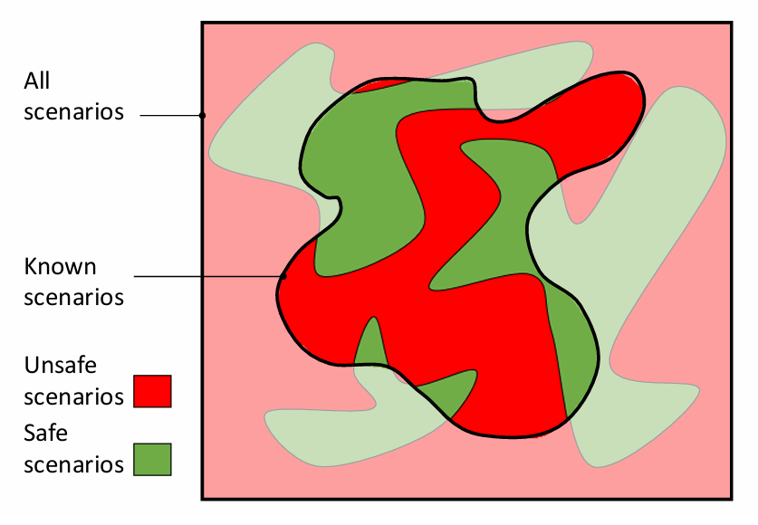<br>

<small>

**Source:** [Delseny *et al.* (2021)](https://arxiv.org/abs/2310.06506) / DEEL

</small>

--

### Safety Envelope > Doer/Checker

<br>

--

### Safety Envelope > Doer/Checker

The **doer** optimizes for performance.

The **checker** handles <span style='color: red'>**safety**</span>. {.fragment .fade-in}

--

### Doer/Checker > Automotive

The **doer** can be low SIL ⬇️ 

The **checker** <u>*must*</u> be **high** SIL 🚨 {.fragment .fade-in}

--

#### Automotive > ISO26262

Safety Integrity Levels (SIL)


--

#### Aerospace > DO-178C

Development Assurance Levels (DAL)


--

##### [Runway Sign Classifier](https://www.mathworks.com/help/deeplearning/ug/verify-an-airborne-deep-learning-system.html)

Is this application DAL-C or DAL-D?

<br>

<small>

**Source:** Adapted from [Dimitriev *et al.* (2023)](https://arxiv.org/abs/2310.06506)

</small>

--

##### [NASA on using LLMs for Assurance](https://ntrs.nasa.gov/citations/20250001849)


--

#### (Neural) Simplex Architecture

<br>

<small>

**Source:** [Phan *et al.* (2019)](https://arxiv.org/abs/1908.00528)

</small>

--

#### Simplex Architecture > Automotive

<br>

--

##### Patent: [US10962972B2](https://patents.google.com/patent/US10962972B2/en)

Safety Architecture for Autonomous Vehicles

<br>

--

#### Saab / Helsing Collaboration


<small>

> "While all of Helsing’s work primarily focused on software model training, integration with Gripen E APIs and testing, Saab actually set the groundwork for operating a software-defined aircraft several years ago with an overhaul to the Gripen’s avionics."

</small>

--

### Saab's [Split Avionics](https://www.mobilityengineeringtech.com/component/content/article/53597-are-military-avionics-systems-ready-for-artificial-intelligence)


--

#### Tactical vs Flight Critical

 

<small>

> "Gripen’s avionics system separates 10% of the aircraft's flight critical management codebase from 90% of its tactical management code, resulting in avionics that are 'hardware agnostic'."

</small>

--

#### [Software-Defined Assurance](https://helsing.ai/newsroom/helsing-white-paper-software-defined-assurance) / Helsing

<small>

> "**Many of the well-known approaches used to ensure the reliability of software are difficult or impossible to apply to AI-based software**, where models are created
from data rather than hand-coded by software developers. This creates
friction in the commissioning and development of AI-based software,
because it is unclear what criteria will be used to assure it.
The potential worst case is that assurance of systems involving AI are
subject to a matrix of both poorly-fitting existing requirements and new
but underspecified AI-related requirements."

</small>

--

### Airborne AI/ML Assurance Lifecycle 


--

### Testing

AI is part of the system.

Test it like it is. {.fragment .fade-in}

--

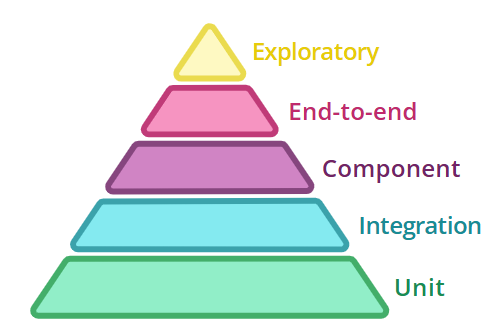

--

The [ECSS ML handbook](https://ecss.nl/home/ecss-e-hb-40-02a-15-november-2024/) suggests checking:

- Known cases (the expected)

- Coverage (the internals)

- Edge cases (the unknown)

- Adversarial cases (the hostile)

--

### V-Cycle $\rightarrow$ W-Cycle

<br>

<small>

**Source:** [EASA / Daedalean (2024)](https://www.easa.europa.eu/en/document-library/general-publications/concepts-design-assurance-neural-networks-codann)

</small>

--

### Formal Verification

*Mathematically* prove that <br> certain behaviors <u>cannot</u> happen.

--

Here's a crash course on **formal methods** <br>for software verification...

--

<br>

\* Oldie, but goodie!

--

#### Reactive System

Systems that maintain an ongoing interaction <br>with the environment, as opposed to computing <br>some final value on termination.

--

##### Concurrent programs


--

##### Embedded and process control programs


--

##### Perpetually ongoing processes


--

##### Operating systems


--

### These systems are not <br> defined by <u>**what**</u> they do

but <span style='color: red'><u>**when**</u></span> they do it. {.fragment .fade-in}

--

There's a saying at Google...

> "Software engineering is programming integrated over **time**." {.fragment .fade-in}

<small>

Winters, Manshreck & Wright (2020)

</small>

--

If you take this *literally*...

$$\texttt{SWE} = \int \texttt{Programming} ~dt$$

--

Then engineering itself is just...

$$f \mapsto \texttt{E}[f] = \int^{\min\[\text{EOL}, ~+\infty\]}_{\max\[-\infty, ~\text{idea}\]} f ~dt$$

--

##### Our Mission

Ensure that certain properties hold **at all times**.

--

##### <span style='color: red'>Safety property</span>

> bad thing never happens

$$\square ~\neg \texttt{bad}$$

--

#### <span style='color: green'>Liveness property</span>

> good thing eventually happens

$$\diamond ~\texttt{good}$$

--

### Formal Methods $\rightarrow$ AI

--


--


--

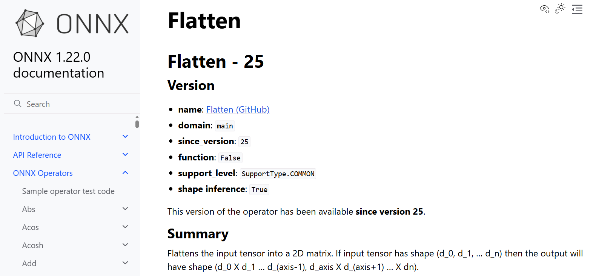

--

#### ONNX $\rightarrow$ <span style='color: red'>Safe</span> ONNX


When AI fails, lives are at stake...

So let's fix the language first!

--

##### Docs $\rightarrow \cdots \rightarrow$ [Why3](https://why3.org/)

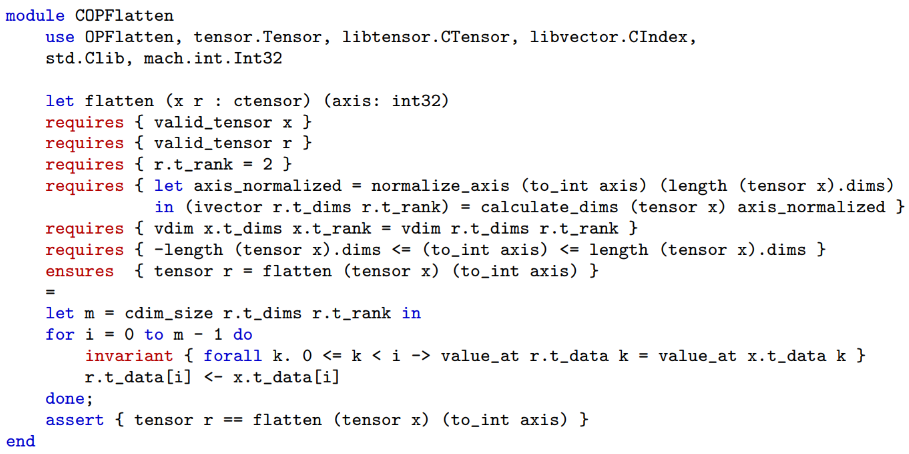

--

##### Property-Based Testing / [Hypothesis](https://hypothesis.readthedocs.io/en/latest/)

```python
"""
This file uses the Hypothesis library to generate a wide range of test cases
for the Flatten operation in ONNX.
"""
import os

import json
import numpy as np
import ml_dtypes

from hypothesis import given, settings
import hypothesis.extra.numpy as hnp
from hypothesis import strategies as st
from hypothesis import assume

from onnx import helper
import onnx.checker
from onnxruntime import InferenceSession
import onnx.reference


from onnx import helper

import tensorflow as tf

if os.path.exists("generated_data.json"):
    os.remove("generated_data.json")


"""
Inputs/attributes for Flatten operation
"""

inputs_attributes = {
    "min_rank_input": 1, #Adjust as needed
    "max_rank_input": 10, #Adjust as needed
    "min_dim_size_input": 1, #Adjust as needed
    "max_dim_size_input": 5, #Adjust as needed
    "ONNXRuntime_Provider": "CPUExecutionProvider" # available providers are CPUExecutionProvider, CUDAExecutionProvider, DmlExecutionProvider
}


"""
Flatten supported types, organized by ONNXRuntime_Provider
"""
flatten_types = {
    "CPUExecutionProvider": {
        "INT8": np.int8,
        "INT16": np.int16,
        "INT32": np.int32,
        "INT64": np.int64,
        "UINT8": np.uint8,
        "UINT16": np.uint16,
        "UINT32": np.uint32,
        "UINT64": np.uint64,
        "FP16": np.float16,
        "FP32": np.float32,
        "FP64": np.float64,
        "STRING": np.str_,
        "BOOL": np.bool_,
        "BFLOAT16": ml_dtypes.bfloat16
    },
    "CUDAExecutionProvider": {
        "INT8": np.int8,
        "INT16": np.int16,
        "INT32": np.int32,
        "INT64": np.int64,
        "UINT8": np.uint8,
        "UINT16": np.uint16,
        "UINT32": np.uint32,
        "UINT64": np.uint64,
        "FP16": np.float16,
        "FP32": np.float32,
        "FP64": np.float64,
        "BOOL": np.bool_,
        "BFLOAT16": ml_dtypes.bfloat16
    },
    "DmlExecutionProvider": {
        "INT8": np.int8,
        "INT16": np.int16,
        "INT32": np.int32,
        "INT64": np.int64,
        "UINT8": np.uint8,
        "UINT16": np.uint16,
        "UINT32": np.uint32,
        "UINT64": np.uint64,
        "FP16": np.float16,
        "FP32": np.float32,
        "FP64": np.float64,
        "BOOL": np.bool_
    }
}

dtype_to_key = {v: k for k, v in flatten_types.get(inputs_attributes["ONNXRuntime_Provider"]).items()}

"""
Store generated data
"""
generated_data = {
    "rank_input_tensor": [],
    "shape_input_tensor": [],
    "x_type": [],
    "axis": []
}

"""
Function to generate valid flatten arguments
"""

@st.composite
@settings()
def valid_slice_args(draw):
    #---------------------------------------------------
    # Restrictions
    #---------------------------------------------------
    
    # X [C2] - Input/Output Types Consistency
    all_valid_types = list(flatten_types.get(inputs_attributes["ONNXRuntime_Provider"]).keys())
    input_type = draw(st.sampled_from(all_valid_types))
    input_dtype = flatten_types.get(inputs_attributes["ONNXRuntime_Provider"])[input_type]

    if np.issubdtype(input_dtype, np.integer):
        min_val = np.iinfo(input_dtype).min
        max_val = np.iinfo(input_dtype).max
        input_strategy = st.integers(min_value=min_val, max_value=max_val)
    elif np.issubdtype(input_dtype, np.floating):
        min_val = np.finfo(input_dtype).min
        max_val = np.finfo(input_dtype).max
        input_strategy = st.floats(min_value=min_val, max_value=max_val)
    elif np.issubdtype(input_dtype, np.bool_):
        input_strategy = st.booleans()
    elif np.issubdtype(input_dtype, np.str_):
        input_strategy = st.text(
            alphabet=st.characters(codec="utf-8", blacklist_characters='\x00')
        )
    elif input_type == "BFLOAT16":
        min_bfloat16 = float(ml_dtypes.finfo(flatten_types.get(inputs_attributes["ONNXRuntime_Provider"])["BFLOAT16"]).min)
        max_bfloat16 = float(ml_dtypes.finfo(flatten_types.get(inputs_attributes["ONNXRuntime_Provider"])["BFLOAT16"]).max)
        input_strategy = st.floats(min_value=min_bfloat16, max_value=max_bfloat16)

    #---------------------------------------------------
    # Input X
    #---------------------------------------------------
    rank_input_tensor = draw(st.integers(
        min_value=inputs_attributes["min_rank_input"],
        max_value=inputs_attributes["max_rank_input"]
    ))

    shape_input_tensor = []
    for _ in range(rank_input_tensor):
        dim_size = draw(st.integers(
            min_value=inputs_attributes["min_dim_size_input"],
            max_value=inputs_attributes["max_dim_size_input"]
        ))
        shape_input_tensor.append(dim_size)

    if input_type == "BFLOAT16":
        temp_tensor = draw(hnp.arrays(dtype=np.float32, shape=shape_input_tensor, elements=input_strategy))
        tf_tensor = tf.cast(tf.constant(temp_tensor), tf.bfloat16)
        x = tf_tensor.numpy()
    else:
        x = draw(hnp.arrays(dtype=input_dtype, shape=shape_input_tensor, elements=input_strategy))

    #---------------------------------------------------
    # Attribute axis
    #---------------------------------------------------

    # axis [C1] ->  X [C1], axis [C2] - Axis Range
    axis = draw(st.integers(
        min_value=-(rank_input_tensor),
        max_value=rank_input_tensor
    ))

    #---------------------------------------------------
    # Output y 
    #---------------------------------------------------
    
    # Y [C1]
    y_shape = []
    dy0 = np.prod(shape_input_tensor[:axis])
    dy1 = np.prod(shape_input_tensor[axis:])
    y_shape = [int(dy0), int(dy1)]

    return x, axis, y_shape

"""
Function that runs the test
"""
@settings(max_examples=10000, deadline=None)
@given(valid_slice_args())
def test_flatten(args):
    x, axis, y_shape = args
    generated_data["rank_input_tensor"].append(len(x.shape))
    generated_data["shape_input_tensor"].append(list(x.shape))
    x_type_key = dtype_to_key.get(x.dtype.type, str(x.dtype))
    generated_data["x_type"].append(x_type_key)
    generated_data["axis"].append(axis)
    y = run_onnx_flatten_test(x, axis, y_shape, inputs_attributes["ONNXRuntime_Provider"])
    if axis < 0:
        axis += len(x.shape)
    check_constraints(y_shape, y, x, axis)


def teardown_module():
    """
    Function to write generated data to a json file
    """
    data = {
        "title": "Data generated by Hypothesis for Flatten operation tests",
        "min_rank_input": inputs_attributes["min_rank_input"],
        "max_rank_input": inputs_attributes["max_rank_input"],
        "rank_input_tensor": generated_data["rank_input_tensor"],
        "min_dim_size_input": inputs_attributes["min_dim_size_input"],
        "max_dim_size_input": inputs_attributes["max_dim_size_input"],
        "shape_input_tensor": generated_data["shape_input_tensor"],
        "x_type": generated_data["x_type"],
        "axis": generated_data["axis"],
        "ONNXRuntime_Provider": inputs_attributes["ONNXRuntime_Provider"]
    }


    with open("generated_data.json", "w", encoding="utf-8") as f:
        json.dump(data, f, indent=4)

def run_onnx_flatten_test(x, axis, y_shape, provider):
    """
    Function that runs the ONNX Slice operation
    """
    x_onnx = helper.make_tensor_value_info('x', helper.np_dtype_to_tensor_dtype(x.dtype), x.shape)

    # Y [C3] -> X [C2] - Input/Output Types Consistency
    y_onnx = helper.make_tensor_value_info('y', helper.np_dtype_to_tensor_dtype(x.dtype), y_shape)

    node_def = helper.make_node(
        'Flatten',
        inputs=['x'],
        outputs=['y'],
        axis=axis
    )

    # Create the graph
    graph_def = helper.make_graph(
        [node_def],
        'test_flatten',
        [x_onnx],
        [y_onnx],
    )

    onnx_model = helper.make_model(graph_def)

    #Let's freeze the opset.
    del onnx_model.opset_import[:]
    opset = onnx_model.opset_import.add()
    opset.domain = ''
    opset.version = 22
    onnx_model.ir_version = 10

    # Verify the model
    onnx.checker.check_model(onnx_model)

    if str(x.dtype) == "bfloat16":
        # Use ONNX Reference Implementation for bfloat16
        # BFLOAT16 is not supported by ONNX Runtime while using numpy
        # An alternative is to use torch tensores and CUDAProvider
        sess = onnx.reference.ReferenceEvaluator(onnx_model)
    else:
        # Use ONNX Runtime for other types
        sess = InferenceSession(onnx_model.SerializeToString(),
                               providers=[provider])
        
    y = sess.run(None, {'x': x})[0]
    print("y shape:", y.shape)
    print("y dtype:", y.dtype)
    print("y:", y)
    return y

def check_constraints(y_shape, y, x, axis):
    """
    Check constraints for generated data
    """
    # X[C1]
    assert axis <= len(x.shape)
    # X[C2]
    x_is_string = np.issubdtype(x.dtype, np.str_) or np.issubdtype(x.dtype, np.object_)
    y_is_string = np.issubdtype(y.dtype, np.str_) or np.issubdtype(y.dtype, np.object_)
    if x_is_string and y_is_string:
        pass
    else:
        assert x.dtype == y.dtype
    # axis[C1] -> X[C1]
    # axis[C2]
    assert -len(x.shape) <= axis <= len(x.shape)
    # Y
    assert (len (y_shape) == 2)
    # Y[C1]
    assert y_shape == list(y.shape)
    # Y[C2]
    assert check_coords_value(x, y, axis)
    # Y[C3] -> X[C2]


def calculate_y_coords(x_coords, x_shape, axis):
    """
    Calculate the corresponding coordinates in Y given coordinates in X
    """
    n = len(x_shape)
    a = 0
    for z in range(0, axis):
        prod = 1
        for k in range(z + 1, axis):
            prod *= x_shape[k]
        a += x_coords[z] * prod

    b = 0
    for z in range(axis, n):
        prod = 1
        for k in range(z + 1, n):
            prod *= x_shape[k]
        b += x_coords[z] * prod
    
    return (a, b)

def check_coords_value(x, y, axis):
    """
    Check if there is a valid correspondence between input and output values
    """
    result = []
    it = np.nditer(x, flags=['multi_index'])
    for x_value in it:
        coords = it.multi_index
        y_coords = calculate_y_coords(coords, list(x.shape), axis)
        y_value = y[y_coords]
        result.append(x_value == y_value)
    return all(result)
```

--

##### Why3 $\rightarrow \cdots \rightarrow$ C

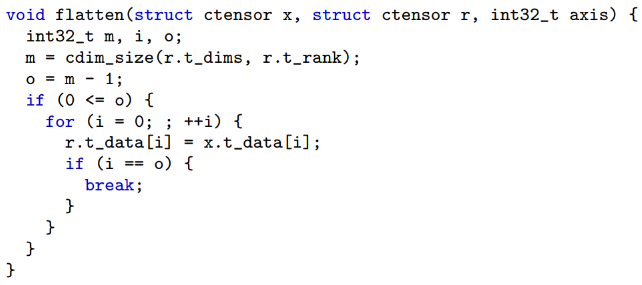

--

### AI $\rightarrow$ Formal Methods

--

#### [Natural Language <br>$\downarrow$<br>Temporal Logic Formulas](https://conformalnl2ltl.github.io/)

<video controls width=50%>
    <source src="https://conformalnl2ltl.github.io/video/robot_dog_1.mp4">
</video>

--

#### [Minimize Hallucinations <br>with Automated Reasoning](https://aws.amazon.com/blogs/aws/minimize-ai-hallucinations-and-deliver-up-to-99-verification-accuracy-with-automated-reasoning-checks-now-available/)


--

### When AI writes <br>most of the software <br> in the world...

who <span style='color: red'>verifies</span> it? {.fragment .fade-in}

--

> Most people think of verification as a cost, a tax on development, justified only for safety-critical systems. **That framing is outdated.** When AI can generate verified software as easily as unverified software, verification is no longer a cost. It is a catalyst.

<small>

― Leonardo de Moura, creator of [Lean](https://lean-lang.org/)

</small>

--

#### [Verina](https://verina.io/): Benchmarking Verifiable Code Generation 

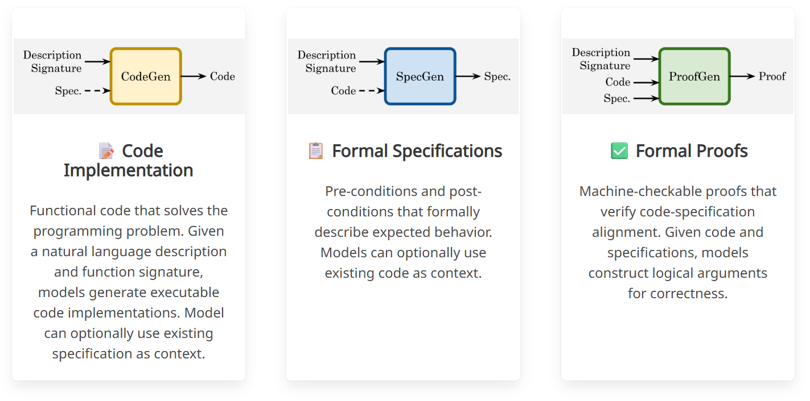<br>

--

**Write** the code

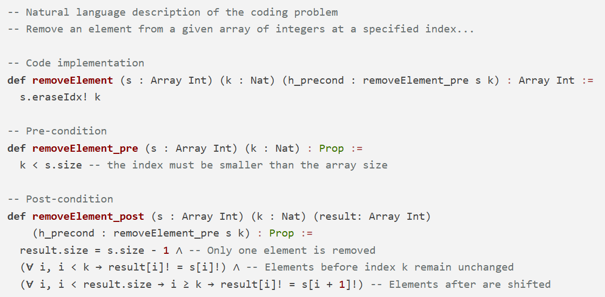

--

**Prove** the code

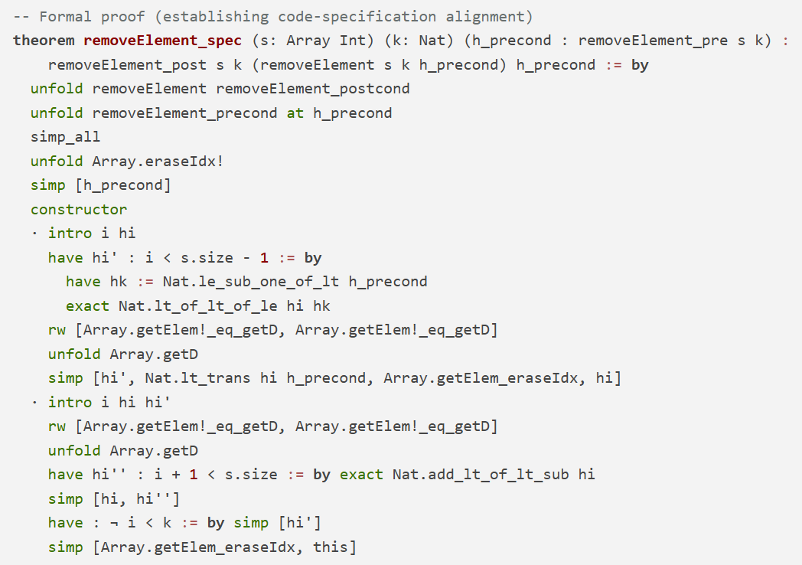<br>

--

**Test** the code

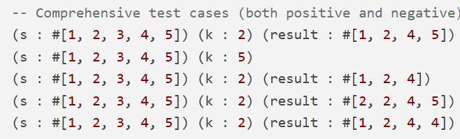<br>

--

### 🔴 Breakpoint

And know for a word from our sponsors!

---

# <span style='color: red'>Dependable</span> AI

--

### Intelligent or not...

Building systems that *last* is

<span style='color: red'>**HARD**</span>

--

### When it comes to AI...

The <span style='color: red'>real</span> challenge isn't model accuracy.

It's system reliability under **UNCERTAINTY**. {.fragment .fade-in}

--

### Typical ML focuses on


--

### But the model is only the <span style='color: red'>beginning</span>

We need to move from models to systems!

--


--

This thread reveals 3 things:

- Engineers don't know their history
- Tool creators have massive egos
- The importance of **modelling the model**

--

## <span style='color: red'>Dependable</span> AI Mindset

1. Expect failure

2. Design for recovery

3. Monitor everything

4. Keep humans around

--

## Engineering Best Practices

Because good intentions are not enough!

--

### Data

> Garbage in, garbage out

--

#### AI systems learn from data

If the data is wrong, incomplete, or drifting, {.fragment .fade-in}

the system will <span style='color: red'>fail</span>. {.fragment .fade-in}

--

#### Your model is only as good as your data

Focus on:
- data validation
- dataset versioning
- distribution monitoring
- label quality checks

--

#### You don’t control your model

<span style='color: red'>**your data does**</span>

--

## Model

> Accuracy isn't reliability

--

A high benchmark score does not guarantee <br> **safe real-world behavior**

--

#### Good numbers are not enough

Evaluate for:
- robustness
- edge cases
- distribution shift
- calibration

--

#### Test the failure modes

**not** just the average case.

--

## Observability

> If you can’t see it, you can’t trust it.

--

#### Watch everything, don't fly blind

Track:
- data drift
- prediction drift
- system health
- anomaly signals

--

#### Dogs not barking?

Silent failures are the most dangerous failures.

--

## Guardrails

> Expect failure. Design for safety.

--

#### Models will eventually fail.

Systems must handle that *safely*.

--

#### Build the safety net

Common patterns:

- confidence thresholds
- fallback logic
- human escalation
- policy checks

--

#### Reliable systems don't fail silenty...

They fail *gracefully*.

--

## Humans

> AI works best when we are around

--

#### What machines can't replace (yet!)

Humans provide:

- context
- judgment
- accountability

--

Design systems that allow:

- review
- intervention
- override

--

```python
# Predict: AI takes a shot...
result, confidence = model.predict(input_data)

# Check: Too unsure? Don't guess!
if confidence < threshold:
    result = route_to_fallback() or route_to_human()

# Log: Always leave a trail
log_decision(input_data, result)
```

--

### Human <span style='color: red'>in</span> the loop

AI acts only when a <br>human approves each decision.

--

### Human <span style='color: red'>on</span> the loop

AI acts autonomously, but humans <br>monitor and can intervene.

--

### Human <span style='color: red'>over</span> the loop

AI operates independently, while humans <br>set goals and review outcomes.

--

### Humans are <span style='color: red'>not</span> the weakness.

We are part of the safety system.

--

## Dependability is <span style='color: red'>not</span> a feature

It's engineering discipline. {.fragment .fade-in}

---

# AI that (actually) <span style='color: green'>matters</span>

--

## AI <span style='color: red'>where</span> it matters most


--

### NOT

> Build smarter AI

--

### BUT

> Build trustworthy systems
> that safely amplify our capabilities.

--

## AI needs to <span style='color: red'>pivot</span>

model accuracy $\rightarrow$ system reliability

benchmarks $\rightarrow$ real-world impact {.fragment .fade-in}

research $\rightarrow$ engineering {.fragment .fade-in}

--

#### Engineering is about solving 

<span style='color: red'>real problems for real people</span>

$$\cdots$$

#### Engineering does not stop at *it works*

<span style='color: red'>it begins at <u>**it lasts**</u></span>

--

## Build AI that <span style='color: green'>matters</span>

AI first, human always!

---

# PR<span style='color: red'>FAQ</span>

--

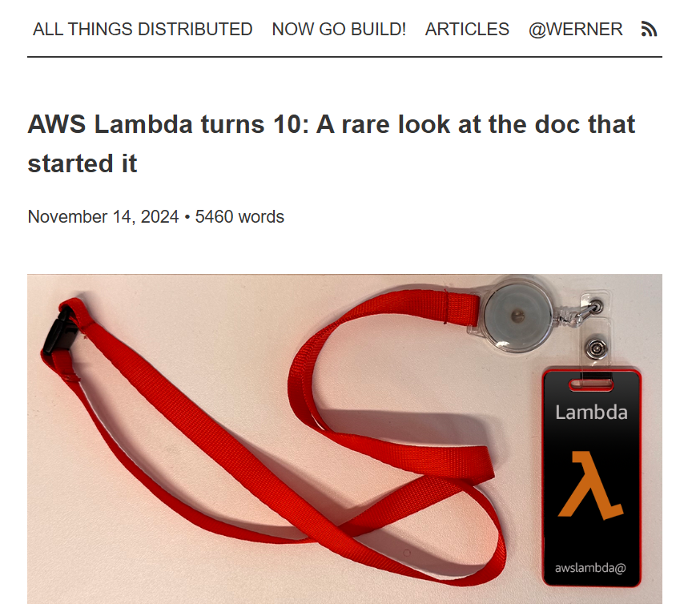

--

### LISBON – (Mar 2026)

A new talk titled 'Build AI That Matters' <br>introduces a practical framework for designing <br>dependable AI systems that deliver<br> real-world impact.

--

### Why isn't model accuracy enough?

--

Production failures rarely originate<br> from the model itself.

$$\cdots$$

Dependability requires addressing <br>the **entire system**. {.fragment .fade-in}

--

### Doesn't adding reliability slow innovation?

--

No, it makes deployments **sustainable**.

$$\cdots$$

Without it, repeated failures erode trust <br>and slow adoption. {.fragment .fade-in}

--

### What role do humans play?

--

Humans are not replaced by AI.

$$\cdots$$

They are part of the system that ensures <br> **safety and accountability**. {.fragment .fade-in}

--

### What is the key takeaway?

--

AI creates value only when it is <br>**reliable** enough to be **trusted**.

$$\cdots$$

The future of AI will be shaped <br>not just by better models, but by better <br>**engineering** of the systems around them. {.fragment .fade-in}

---

## Thank you!

🙏